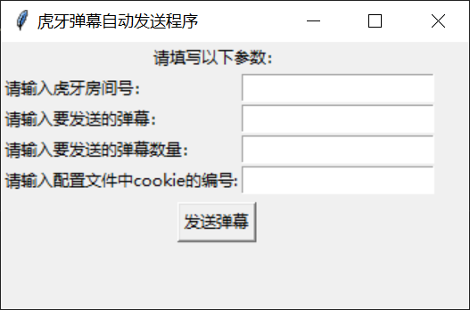

# 虎牙弹幕自动发送小程序
---
### 环境配置
    安装chrome浏览器
    将对应谷歌浏览器版本的chromedriver.exe加入环境变量

### 使用方法
* 配置好上述环境后 双击main.exe 打开软件界面

* 在输入框里分别输入虎牙房间号、要发送的弹幕、发送弹幕的数量、以及配置文件中cookie的编号
* 配置文件config.json中有一个cookie键，将自己浏览器中的cookie值复制保存在配置文件对应键下
* 输入完软件界面里的参数后，点击发送按钮，即可运行程序发送弹幕（这里要注意的一点就是，虎牙直播间连续发送五个弹幕后就会限制你的发送20秒左右）
        
